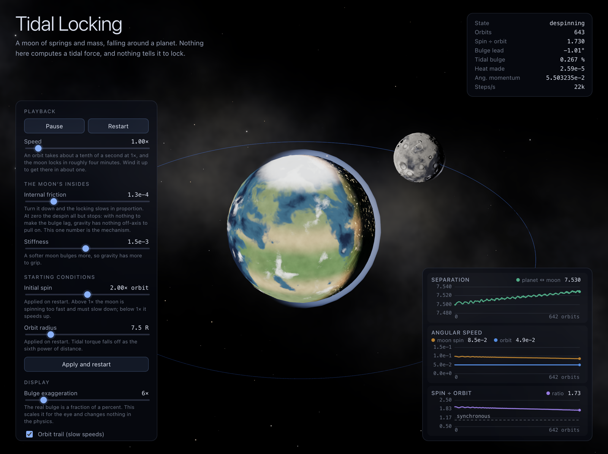

# Tidal Locking

An interactive simulation of a moon becoming tidally locked to its planet — built so that
the locking is never programmed, only allowed to happen.

**[▶ Open the simulation](https://andeplane.github.io/demos/tidal-locking/)**



---

## The idea

Point masses cannot tidally lock. Gravity acting on a point exerts no torque about that
point, so a point-mass moon spins forever at whatever rate it started with.

Give the moon an *extent* and the picture changes. The near side is closer to the planet
than the far side, so it is pulled harder, and the moon stretches into a slight ellipsoid.
If the moon were perfectly elastic that bulge would track the planet exactly, stay
symmetric about the planet–moon line, and still produce no net torque. But real rock is
lossy. The bulge takes time to form and time to relax, so on a moon that spins faster than
it orbits, the bulge is dragged slightly *ahead* of the planet direction. Gravity then has
something off-axis to pull on, and that pull is a brake.

So the whole phenomenon needs exactly three ingredients: **gravity**, **an extended
deformable body**, and **dissipation**. This simulation implements those three and nothing
else. There is no tidal-force term in the code, no torque term, and nothing anywhere that
checks whether the moon is locked.

## What is actually simulated

- The **planet** is a single point mass. It moves: every moon particle pulls on it, so the
  barycentre is real and the recoil is real.
- The **moon** is ~200 point masses in a ball, joined to their neighbours by springs with
  dashpots — roughly 1,200 springs, about 12 per particle.
- Every particle feels ordinary inverse-square gravity toward the planet, and the planet
  feels each reaction.
- Each spring pushes along its own axis with `F = -k(|d| - L₀) - c(ḋ·d̂)`.
- Integration is velocity Verlet, with forces evaluated at the half-step velocity so the
  velocity-dependent dashpot stays second-order.

That is the entire model. It runs in a Web Worker; the renderer never touches it.

### Why the damping must act along the bond

`c(ḋ·d̂)d̂` is a central force: equal and opposite, and directed along the line joining the
two particles. So it conserves linear *and* angular momentum exactly. Damping with any
component perpendicular to the bond would instead be friction against an absolute frame —
it would slow the moon's rotation directly, and the simulation would "demonstrate" tidal
locking by quietly applying a brake.

The check that this is honest: **total angular momentum is conserved to about one part in
10¹⁴** over millions of steps, while the moon's spin angular momentum visibly drains into
the orbit. The readout panel shows both. Energy, by contrast, is *not* conserved — it
steadily becomes heat inside the moon, which is the point.

## Two details that mattered more than expected

**The initial condition has to be relaxed first.** Released as an unstressed sphere into a
tidal field, the moon has to grow a tidal bulge and a centrifugal bulge at once, and it
overshoots. The first orbits are then dominated by a violent ring-down that has nothing to
do with tidal locking but looks exactly like it. The moon is settled hard-damped first,
then its velocity field is projected onto the rigid-body motion carrying the same momenta,
and only then does the clock start.

**The rest shape has to be made isotropic.** A few hundred randomly placed points carry an
intrinsic quadrupole asymmetry of order 1/√N — about 7% at N = 200, several times larger
than the ~0.2% tidal bulge. Left alone, the moon locks because gravity grabs a permanent
lump, the way a lopsided asteroid does, and the lock time stops responding to the material
constants at all. Squashing the cloud until its second-moment tensor is isotropic removes
the l = 2 term and leaves the tidal bulge as the only handle gravity has.

## The graphs

- **Separation** — the moon recedes by a couple of percent as it despins. Angular momentum
  lost from the spin has to go somewhere, and it goes into the orbit. This is the same
  effect that pushes the real Moon away from Earth at about 3.8 cm/year.
- **Angular speed** — the moon's spin rate and its orbital rate, on one axis. They start a
  factor of two apart and converge. That convergence *is* tidal locking.
- **Spin ÷ orbit** — the same thing as one number, settling onto 1.

The readouts also show the bulge lead angle: positive while the moon spins too fast,
crossing zero as it locks. It is the direct cause of everything else on screen.

## Things to try

- **Set internal friction to zero.** The moon still bulges and the bulge still tracks the
  planet, but the despin all but stops: over 2,500 orbits the spin ratio falls by 6% with
  friction off versus reaching synchronous with it on — roughly thirteen times slower, and
  the residue is the integrator's own tiny energy leak rather than physics. This is the
  most convincing thing in the simulation.
- **Switch off the co-rotating view.** The default holds the moon still against a
  turning sky, which is the only way the rotation is legible at this time lapse. The
  fixed frame shows the orbit as an orbit, but the moon strobes.
- **Set the initial spin below 1×.** The moon is now turning too slowly, the bulge lags
  rather than leads, and the torque runs the other way: it *speeds up* to synchronous.
- **Turn on the particles and springs** to see the machinery the smooth ellipsoid is made
  of.
- **Turn up the bulge exaggeration.** The real deformation is about 0.2% of the moon's
  radius; the slider scales it for the eye and changes nothing in the physics.
- **Follow the planet–moon line.** Once locked, the moon simply stops moving in that frame
  — which is what "the same face always points at the planet" means.

## Honest caveats

The numbers are not the Earth–Moon system and are not trying to be. Tidal torque falls off
as the sixth power of distance, which is why the real Moon took on the order of 10⁷ years
to lock. To make it watchable, this moon orbits at 7.5 of its own radii (the real one sits
at about 221), is far softer than rock, and is far more lossy. The planet is drawn at about
2.5 moon radii rather than the true 3.67, for composition. The *mechanism* is untouched —
only the scales that set its speed.

The time lapse is paced to hold the moon's *apparent* rotation near 1.6 turns per second
rather than to advance simulated time at a constant rate. What the eye tracks is the moon
turning relative to the planet, at `(ratio − 1)` turns per orbit, so a fixed rate strobes
at the start and crawls at the end. This spends the wall clock where something is
happening, and it is why the run speeds up as the spin winds down.

The moon's spin rate is measured as `ω = I⁻¹L` in its own centre-of-mass frame, which is
the honest definition for a body that is actively deforming and so has no rigid rotation
matrix to differentiate.

## Running it

This demo is self-contained and has its own dependencies; it is not part of the site's
React stack. The site's build runs it via `scripts/build-demos.mjs` and stages the output
into `public/demos/tidal-locking/`.

```bash
cd demos/tidal-locking
npm install
npm run dev        # http://localhost:5173
npm run build      # typecheck + production build into dist/
```

There is also a headless driver, used to choose the material constants — which is how the
physics was validated before any rendering existed:

```bash
npm run tune -- --orbits=2500 --samples=10
npm run tune -- --damping=0 --orbits=2500      # watch the despin nearly stop
```

It prints the despin curve, the bulge lead angle, the energy drift and the angular momentum
drift, and finishes with the spin-to-orbit angular momentum budget.

With the shipped defaults it reports:

```
   orbits     dist    w_orb   w_spin    ratio    lead°   strain     dE/E     dL/L
    600.0   7.5222  4.90e-2  5.90e-2   1.2057     0.13   0.0027   1.2e-3  9.9e-15
    800.0   7.5296  4.89e-2  5.58e-2   1.1412     0.12   0.0027   1.6e-3  8.8e-15
   1000.0   7.5449  4.87e-2  4.89e-2   1.0024     0.01   0.0028   1.8e-3  1.1e-14
   1800.0   7.5435  4.88e-2  4.90e-2   1.0057     0.13   0.0029   2.5e-3  8.7e-15
   2600.0   7.5433  4.88e-2  4.90e-2   1.0043    -0.24   0.0029   3.2e-3  1.7e-14

locked (3%)    orbit 1000.0
recession      0.676 %
ang.mom drift  1.44e-14

spin           5.6091e-4 -> 3.6030e-4   (-2.01e-4)
orbit          5.4232e-2 -> 5.4432e-2   (+2.01e-4)
total          5.4792e-2 -> 5.4792e-2   (+7.91e-16)
heat           5.865e-6  (0.43 % of initial KE)
```

The spin loses exactly what the orbit gains, to fifteen digits, and the bulge lead stays
positive the whole way down and crosses zero at synchronous. Nothing arranged that.

## Layout

```
src/physics/     the simulation. No three.js, no DOM — runs in Node and in a worker.
  params.ts      every tunable, in one typed place
  sampling.ts    blue-noise ball, made isotropic
  world.ts       forces and the Verlet step
  diagnostics.ts everything the graphs and readouts derive from
src/sim/         the worker and its main-thread handle
src/render/      three.js scene, procedural planet and moon
src/ui/          canvas charts and the control panel
tools/tune.ts    headless driver
```

## Imagery

The planet and the moon are real data, not procedural noise. Procedural surfaces were
tried first, and the verdict was that they never read as *Earth* or as *the Moon* — the
eye rejects wrong coastlines and wrong maria immediately, however good the noise is. What
procedural still wins at is anything that moves, so the clouds and the atmosphere remain
shaders.

| Map | Source |
|---|---|
| Earth day surface | [Blue Marble Next Generation with topography and bathymetry](https://visibleearth.nasa.gov/images/73776), NASA Earth Observatory (Reto Stöckli) |
| Earth night lights | [Black Marble 2016](https://visibleearth.nasa.gov/images/144898), NASA Earth Observatory |
| Earth water mask | NASA-derived, via the MIT-licensed [three-globe](https://github.com/vasturiano/three-globe) example assets |
| Moon colour | [CGI Moon Kit](https://svs.gsfc.nasa.gov/4720), NASA Scientific Visualization Studio, from LROC |
| Moon elevation | [CGI Moon Kit](https://svs.gsfc.nasa.gov/4720), NASA SVS, from the LOLA laser altimeter |

NASA imagery is in the public domain; NASA is acknowledged as the source and does not
endorse this project. About 4 MB in total.

The moon is shaded with the lunar-Lambert law of McEwen, as used by USGS ISIS for lunar
imagery, plus a shadow-hiding opposition surge. It matters: at full phase that law reduces
to Lommel–Seeliger, which has *no* limb darkening, and it is why the real full moon looks
like a flat cut-out disc rather than a shaded ball. Lambert shading here looks like
snooker. The exposure is set so the sub-solar point lands near 0.26 in scene-linear terms,
which is where the 0.06-to-0.20 span of real lunar albedo separates into the most tonal
steps under ACES; brighter than about 1.0 and mare, highland and fresh ejecta all compress
into the top of the curve and the moon goes flat white.

## Licence

MIT for the code. The NASA imagery under `public/textures/` is public domain.
